# Machine_Learning_Trading_Bot

## Overview

This analysis aims to enhance the existing simple trading signals of a trading bot with machine learning algorithms that can adapt to new data. The dataset is in a CSV file that contains OHLCV data for an MSCI–based emerging markets ETF that iShares issued. 

## Steps:

The steps for this analysis are divided into the following sections:

* Establish a Baseline Performance

* Tune the Baseline Trading Algorithm

* Evaluate a New Machine Learning Classifier

* Create an Evaluation Report

----

## Results

### **Original Simple Momentum Trading Strategy**
 
The performance of the simple momentum strategy is not good for this set of stocks data, as shown in the plot below:

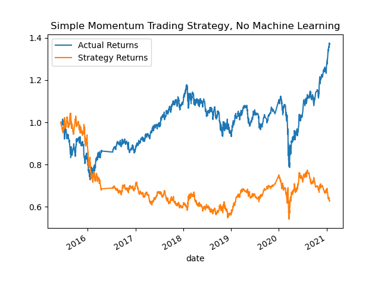
 
 

### **Machine learning strategies (Support Vector Classification) - Baseline**
The machine learning strategy using the Support Vector Classification, with a short 4-day and a long 100-day Simple Moving Average (SMA), and 3 months of training data, showed reasonably good performance against the baseline. The return performance tracked closely the actual for most years, and from 2019, the performance is consistently above the actual returns. See the plot below:

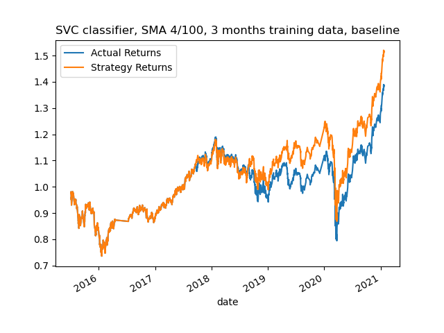
 
 

### **Tuned machine learning strategies (change training and SMA windows)**
 
Changing Training Windows - Changing the training window from 3 to 6 months improved the performance quite significantly from late 2020 onwards, although the performance is below the actual returns in 2019 to mid 2020. Using the 6 months training period should be considered going forward. Further extending the training period to 9 months however, results in an 'erratic' performance compared to actual returns. See plots below:

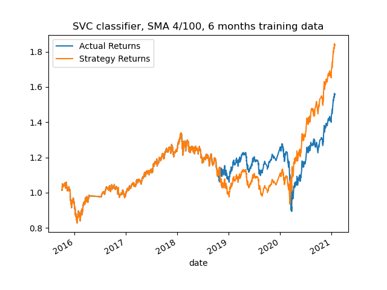

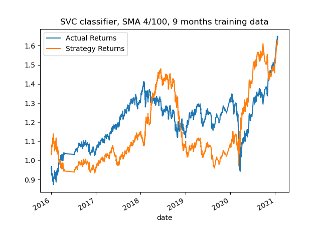

 
Changing SMA Windows - The series of plots below showed that changing the SMA windows is not a good approach in the attempt to improve the stragety returns. For the same long window of 100 days, varying the short window from 4 days results in the strategy return to only more closely track the actual return. Reducing the long window from 100 to 50 days did not produce a consistently good return over the years, and increasing the long window or both windows can be detrimental to the strategy returns.

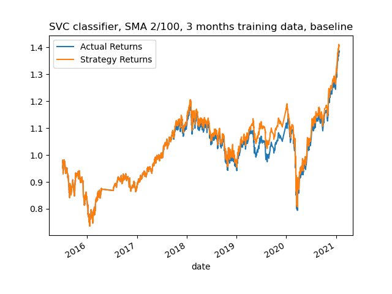

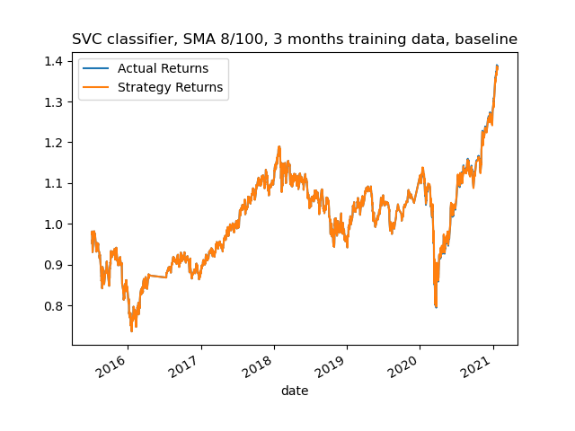

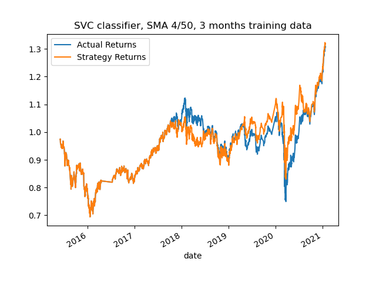

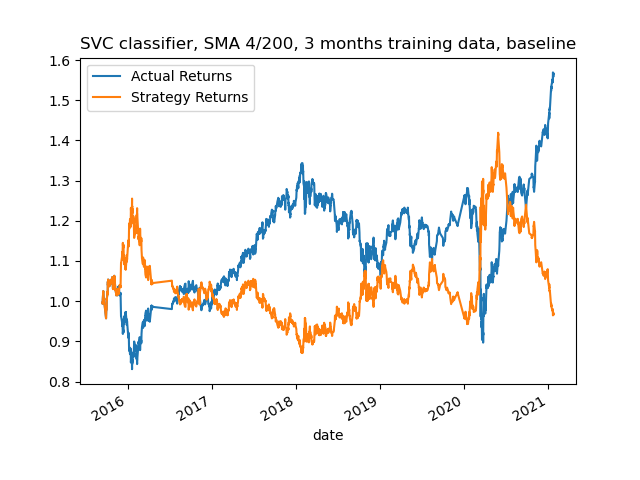

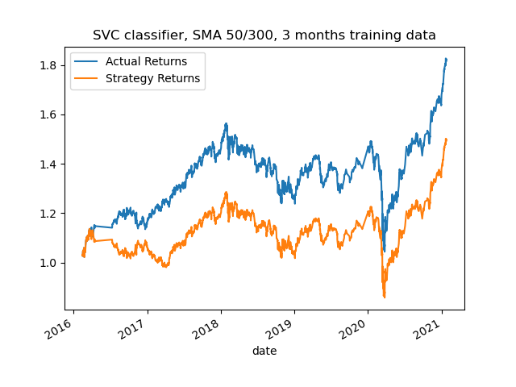

 
 

### **Tuned machine learning strategies (change classifiers)**
 

Of three other classifiers used, AdaBoost produced better returns from mid 2020, and poorer returns in 2019 and mid-2020. See plots below:
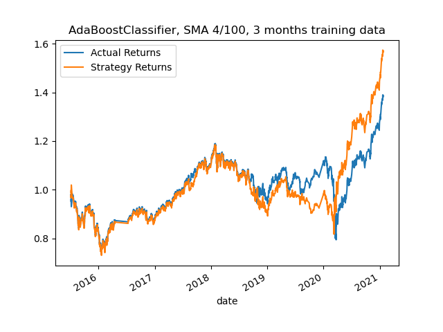

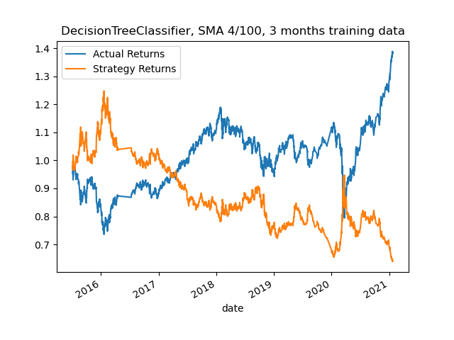

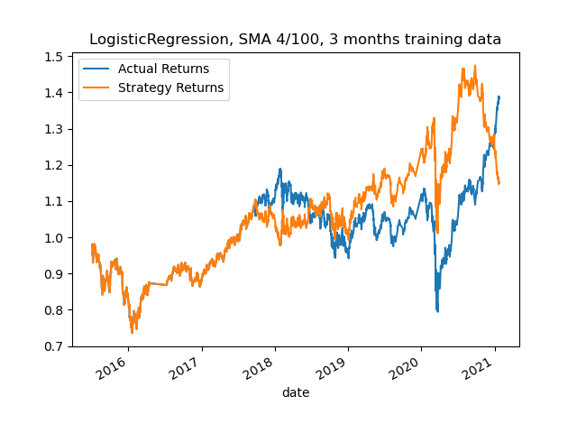

 
 

---
## Conclusions

  For this stock dataset, the simple momentum strategy yielded poorer returns compared to the actual returns. The strategy return is consistently better than the actual return when machine learning using Support Vector Classification and a short-long rolling window of 4-100 days for SMA, and a 3-month training period is used.

---

## Technologies

This analysis is written for use with Jupyter Lab. It uses the following packages:. It uses the following packages:

* [Pandas](https://github.com/pandas-dev/pandas)
* [NumPy](https://pypi.org/project/numpy/)
* [Matplotlib](https://pypi.org/project/matplotlib/)
* [sklearn](https://scikit-learn.org)

 

---

## Usage

In Windows GitBash or Mac Terminal app, enter "Jupyter Lab". Then open and run "machine_learning_trading_bot.ipynb".

The "emerging_markets_ohlcv.csv" file must be in a sub-folder "Resources".

 

---

## Contributors

This application is written by James Tan, with code snippets provided UBC Extension.

 

---

## License

MIT.